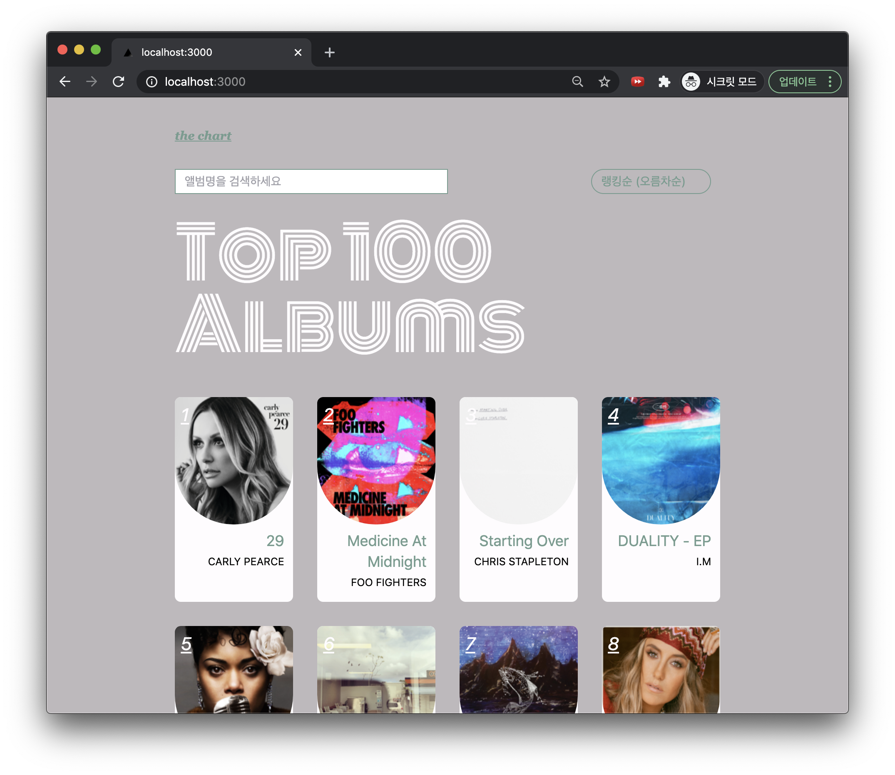

[Go to demo](https://the-chart.vercel.app/)



# How to run

```bash
yarn install
yarn dev
```

Then go to http://localhost:3000 in the browser

# Objective

Create a website that displays Top 100 albums chart in a modern and sleek manner.

### Design references

- [Color theme reference](https://www.behance.net/gallery/110856055/Florensans-Typeface?tracking_source=search_projects_recommended%7Cmodern)
- Main colors: white(#fefcfe), gray(#beb9bc), mint(#739c8f)

# To-dos

- [x] Analyse JSON api structure
- [x] Draw out simple layout mockups (in paper)
- [x] Decide on a design concept/color theme
- [x] List out to-dos

---

- [x] Create next app
- [x] Enable TypeScript
- [x] Add tailwindcss for styling
- [x] Create basic page/component structure
- [x] Implement `<AlbumThumbnail>`
- [x] Add swr for caching/data-depulication of fetched data
- [x] Add axios
- [x] Create `useTop100Chart` swr hook and use it
- [x] Implement /albums/[rank] page
- [x] Create `useAlbum(rank)` swr hook and use it
- [x] Implement several sort options
- [x] Implement searching
- [x] Implement navbar

---

- [x] Make container responsive
- [x] Add custom colors
- [x] Apply style to `<Top100Chart>`
- [x] Apply style to `<AlbumThumbnail>`
- [x] Apply style to `<SortOption>`
- [x] Apply style to `<SearchBar>`
- [x] Apply style to /albums/[rank] page

---

- [x] Add hover to `<AlbumThumbnail>` style

# Used libraries

- tailwindcss
- swr
- axios
- moment
